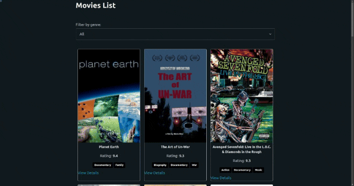

# Movies 

We will create a simple app that shows a list of movies, we can filter the movies by name/genre etc..

We will be using https://yts.mx/api to get the movies.

## ScreenShots 

## Steps:

1. Create a new react app using `pnpm create vite@latest` command.
2. Clear the default content of the app.
3. setup [pico css](https://picocss.com/docs/) using `cdn` link by adding `<link rel="stylesheet" href="https://cdn.jsdelivr.net/npm/@picocss/pico@1/css/pico.min.css">` to the `index.html`.
4. install `react-router-dom` using `pnpm i react-router-dom`.
5. install redux toolkit using `pnpm i @reduxjs/toolkit react-redux`.
6. Setup to Pages: 
    - `MovieList` page: will show the list of movies at the route `/`.
    - `SingleMovie` page: will show the details of the movie at the route `/:id`.

7. Create a `slice` called `movies` that will hold the movies data, this will be used by both pages.
8. Create a `slice` called `singleMovie` that will hold a singleMovie data, this will be used by the `SingleMovie` page.
9. create a `store` that will hold the `movies` and `singleMovie` slices.
10. import the `store` in the `App.jsx` file and wrap your pages  with the `Provider` component.
11. in the `MovieList` page, import and use the `useSelector` and `useDispatch` hooks to get the movies data from the store and dispatch the `fetchMovies` action.
12. in the `SingleMovie` page, import and use the `useSelector` and `useDispatch` hooks to get the singleMovie data from the store and dispatch the `fetchSingleMovie` action.
13. in the `MovieList` page, create a `MovieCard` component that will show the movie data.
14. in the `MovieList` page, create a `useEffect` hook to fetch the movies data when the component is mounted.
15. in the `MovieList` page, create a `useEffect` hook to fetch the movies data when the `genre` is changed.
16. in the `SingleMovie` page, use `useParams` hook to get the `id` from the url.
17. in the `SingleMovie` page, create a `useEffect` hook to fetch the singleMovie data when the component is mounted.
18. in the `SingleMovie` page, create a `useEffect` hook to fetch the singleMovie data when the `id` is changed.

Try to make the app have these functionalities: 
* user can see the list of movies.
* user can see the details of a movie.
* user can select the genre of the movies.

## Bonus

* user can search for a movie.
* user can see the list of movies by rating.
* user can see the list of movies by year.
* user can see the list of movies by quality.
* add pagination to the movies list.